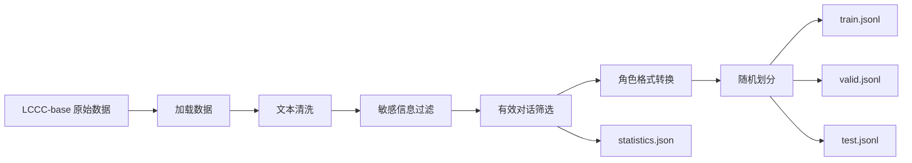

# 作业一：LCCC-base 中文对话数据集预处理与微调格式构建实验报告

> 课程作业：以清华大学团队公开的中文对话数据集 LCCC-base 为例，通过数据预处理流程，构建适用于对话模型微调的对话格式数据集。

## 一、实验目的

本实验以清华大学 CoAI 团队发布的 LCCC（Large-scale Cleaned Chinese Conversation）数据集为对象，完成一个完整、可复现的中文对话数据预处理流程。主要目标如下：

1. 使用 Conda 创建独立 Python 环境，并安装实验所需库。
2. 加载 LCCC-base 数据。
3. 使用 Python、`pandas`、`re` 等工具完成数据处理。
4. 清除 HTML 标签、控制字符、异常空白和连续重复标点等噪声。
5. 使用可配置敏感词表过滤敏感内容。
6. 将原始的多轮 utterance 列表转换为适用于对话模型微调的 `user / assistant` 角色格式。
7. 按训练集、验证集、测试集划分数据，并保存为 JSONL。
8. 记录原始数据量、保留数量、删除数量和数据保留率，为后续模型微调提供可追踪的数据基础。

---

## 二、实验环境

### 2.1 软件环境

- 操作系统：Windows / Linux / macOS 均可
- Python：3.10
- Conda：用于创建隔离环境
- 主要 Python 库：
  - `datasets`：加载 LCCC-base
  - `pandas`：辅助数据分析与统计
  - `re`：正则表达式清洗文本
  - `json`：读写 JSON/JSONL
  - `pathlib`：文件路径管理

项目中的 `environment.yml` 与 `requirements.txt` 已提供完整环境配置。

### 2.2 创建 Conda 环境

```bash
conda env create -f environment.yml
conda activate lccc-preprocess
```

或者手动创建：

```bash
conda create -n lccc-preprocess python=3.10 -y
conda activate lccc-preprocess
pip install -r requirements.txt
```

---

## 三、数据集介绍

LCCC 是清华大学 CoAI 团队发布的大规模中文短文本对话数据集。论文 *A Large-Scale Chinese Short-Text Conversation Dataset* 于 2020 年发表，论文介绍了 LCCC-base 和 LCCC-large 两个版本，并采用规则与分类器相结合的方法进行数据清洗。

官方项目说明 LCCC-base 的原始对话主要来自微博对话，并针对脏字脏词、特殊字符、颜表情、语法不通以及上下文不相关等噪声进行了过滤。官方 Hugging Face 数据集卡片显示，LCCC-base 的数据字段为 `dialog`，每条数据是一组按对话顺序排列的 utterance；官方划分包含 train、validation 和 test。

本实验使用 Hugging Face 上的 `silver/lccc` 数据集镜像进行可复现实验，并在其基础上继续完成课程要求的格式转换和自定义敏感词过滤。

### 3.1 原始数据示意

LCCC 原始数据的一条记录类似：

```json
{
  "dialog": [
    "你好，今天过得怎么样？",
    "挺好的，你呢？",
    "我也不错。"
  ]
}
```

这里的 `dialog` 本质上是一个多轮 utterance 列表。

---

## 四、整体处理流程



整个流程可以概括为：

**原始数据 → 加载 → 清洗 → 敏感词过滤 → 有效性检查 → 角色转换 → 数据集划分 → JSONL 保存。**

---

## 五、数据加载

程序支持两种方式。

### 5.1 Hugging Face 自动加载

默认执行：

```bash
python src/prepare_lccc.py --output_dir data/processed
```

程序调用：

```python
load_dataset("silver/lccc", "base", split="train")
```

并读取每条数据的 `dialog` 字段。

### 5.2 本地 JSON 加载

如果实验环境已经下载了数据，可以使用：

```bash
python src/prepare_lccc.py \
    --input_file data/raw/LCCC-base.json \
    --output_dir data/processed
```

这种方式不依赖在线数据加载，适合课堂电脑或服务器环境。

---

## 六、数据清洗

### 6.1 去除 HTML 标签

实验使用正则表达式：

```python
HTML_RE = re.compile(r"<[^>]+>")
```

例如：

```text
你好 <br> 今天怎么样？
```

会转换为：

```text
你好  今天怎么样？
```

随后再通过空白字符规范化消除多余空格。

### 6.2 去除控制字符

使用：

```python
CONTROL_RE = re.compile(r"[\x00-\x08\x0b\x0c\x0e-\x1f\x7f]")
```

过滤文本中可能影响训练数据解析的控制字符。

### 6.3 规范化空白

使用：

```python
SPACE_RE = re.compile(r"\s+")
```

把连续空白统一为一个普通空格，并删除首尾空白。

### 6.4 处理重复标点

使用：

```python
REPEATED_PUNCT_RE = re.compile(r"([！？。,.，；;：:])\1{3,}")
```

例如：

```text
真的吗！！！！！！！！
```

会限制连续重复标点的长度，降低异常字符模式对训练的影响。

### 6.5 删除空对话和过短对话

对每条对话清洗后，如果有效 utterance 数量小于 2，则认为无法形成基本的问答关系，直接删除。

---

## 七、敏感信息过滤

项目提供 `sensitive_words.txt` 作为可配置词表。

程序读取词表后，对整段对话进行匹配：

```python
def contains_sensitive(text, sensitive_words):
    return any(word and word in text for word in sensitive_words)
```

如果一条对话包含词表中的敏感词，则整条对话被过滤。

### 说明

本实验仓库中的敏感词文件只提供**演示模板**，没有上传大规模敏感词库。实际教学或生产环境中，应根据数据授权、任务场景以及相关规范维护词表。

---

## 八、角色对话格式转换

原始 LCCC 数据是：

```json
[
  "你好，最近怎么样？",
  "挺好的，你呢？",
  "我也不错。"
]
```

本实验转换为适合现代对话模型微调的消息格式：

```json
{
  "messages": [
    {"role": "user", "content": "你好，最近怎么样？"},
    {"role": "assistant", "content": "挺好的，你呢？"},
    {"role": "user", "content": "我也不错。"}
  ]
}
```

转换规则为：

| utterance 位置 | 角色 |
|---|---|
| 第 1 轮 | user |
| 第 2 轮 | assistant |
| 第 3 轮 | user |
| 第 4 轮 | assistant |
| …… | …… |

这种格式可以直接作为很多 SFT / 对话微调数据处理流程的输入基础。

---

## 九、数据集划分

实验程序默认采用：

- 训练集：80%
- 验证集：10%
- 测试集：10%
- 随机种子：42

代码：

```python
train, valid, test = split_data(
    cleaned,
    train_ratio=0.8,
    valid_ratio=0.1,
    seed=42
)
```

这样能够保证每次运行具有稳定的随机划分结果。

> LCCC-base 本身已有官方 train / validation / test 划分。本实验为了完整体现“拆分和保存数据集”的课程要求，在加载指定 split 后又提供了统一的随机划分流程。正式研究时，应优先保留官方划分并明确说明，避免重新随机拆分导致实验结果不可直接与官方结果比较。

---

## 十、输出文件

处理完成后得到：

```text
data/processed/
├── train.jsonl
├── valid.jsonl
├── test.jsonl
└── statistics.json
```

### 10.1 JSONL 格式

每一行代表一个独立训练样本：

```json
{"messages":[{"role":"user","content":"你好"},{"role":"assistant","content":"你好，有什么可以帮助你的吗？"}]}
```

相比把全部数据保存成一个巨大 JSON 数组，JSONL 更适合大规模数据的流式读取和后续处理。

### 10.2 statistics.json

程序会保存：

```json
{
  "raw_records": 10000,
  "kept_records": 9800,
  "removed_empty_or_short": 100,
  "removed_sensitive": 80,
  "removed_invalid": 20,
  "sensitive_word_count": 1,
  "removed_total": 200,
  "retention_rate": 0.98,
  "train_records": 7840,
  "valid_records": 980,
  "test_records": 980
}
```

上面数值仅用于说明字段含义，实际结果以程序运行产生的 `statistics.json` 为准。

---

## 十一、实验运行

### 11.1 小规模验证

由于 LCCC-base 数据量较大，第一次运行建议先取 10000 条：

```bash
python src/prepare_lccc.py \
    --max_samples 10000 \
    --output_dir data/processed
```

程序正常结束后会输出类似：

```text
{
  "raw_records": 10000,
  "kept_records": ...,
  "removed_total": ...,
  "retention_rate": ...,
  "train_records": ...,
  "valid_records": ...,
  "test_records": ...
}

处理完成，输出目录：...
```

### 11.2 完整实验

确认环境和代码无误后，再执行：

```bash
python src/prepare_lccc.py \
    --output_dir data/processed
```

完整 LCCC-base 数据规模较大，运行时间和磁盘占用会明显高于小样本验证，因此建议先进行小规模测试。

---

## 十二、实验结果与分析

本实验的核心成果不是训练一个新的对话模型，而是建立一套从原始语料到模型微调数据的标准化预处理流程。

通过本流程，可以得到以下结果：

1. **数据格式统一**：把原始 `dialog` 列表统一转换成 `messages` 消息格式。
2. **文本质量改善**：去除 HTML 标签、控制字符、异常空白和过度重复标点。
3. **风险内容过滤**：通过外部词表实现可配置的敏感信息过滤。
4. **数据完整性检查**：删除无法构成至少一问一答关系的无效记录。
5. **数据集可直接用于后续训练**：输出 JSONL，便于 SFT / 对话模型训练框架读取。
6. **处理过程可追踪**：通过 `statistics.json` 保存删除原因和数据保留率。

---

## 十三、处理前后示意对比

### 原始格式

```json
{
  "dialog": [
    "<p>你好！！！</p>",
    "你好呀！！",
    "今天怎么样？"
  ]
}
```

### 清洗后

```text
你好！！！
你好呀！！
今天怎么样？
```

### 角色化后

```json
{
  "messages": [
    {"role":"user","content":"你好！！！"},
    {"role":"assistant","content":"你好呀！！"},
    {"role":"user","content":"今天怎么样？"}
  ]
}
```

### 保存后

```text
train.jsonl
valid.jsonl
test.jsonl
```

---

## 十四、实验总结

本实验完成了 LCCC-base 中文对话数据从加载、清洗、敏感信息过滤、角色转换到数据集划分和保存的完整流程。

在数据清洗阶段，利用 Python 正则表达式处理 HTML 标签、控制字符、异常空白和重复标点；利用可配置词表过滤敏感信息；在格式转换阶段，将原始多轮 utterance 按照对话顺序映射到 `user` 与 `assistant` 角色；最后按照固定随机种子划分训练集、验证集和测试集，并以 JSONL 格式输出。

通过本实验，可以进一步认识到：**高质量的训练数据是对话模型微调的重要基础，数据预处理不仅影响数据格式是否能够被模型读取，也会影响训练过程中的噪声水平和最终模型效果。**

---

## 十五、实验报告配图建议

将本 Markdown 报告整理成 Word 提交时，可以加入以下截图作为实验过程证明：

### 图 1：Conda 环境创建

截图内容建议包括：

```text
conda create -n lccc-preprocess python=3.10
conda activate lccc-preprocess
```

### 图 2：依赖安装

截图 `pip install -r requirements.txt` 的成功结果。

### 图 3：LCCC 数据加载

截图 Python 程序开始读取 LCCC-base 的终端输出。

### 图 4：清洗前后对比

建议在 Python 中打印一条原始样本和对应清洗后的结果。

### 图 5：角色格式转换

截图 `messages` 格式的 JSON 样本。

### 图 6：最终输出目录

展示：

```text
data/processed/
├── train.jsonl
├── valid.jsonl
├── test.jsonl
└── statistics.json
```

### 图 7：统计结果

截图程序最后输出的 `statistics.json` 或终端统计结果。

---

## 十六、项目文件说明

```text
myworkmodel/
├── README.md
├── report.md
├── requirements.txt
├── environment.yml
├── sensitive_words.txt
├── .gitignore
├── data/
│   └── README.md
└── src/
    └── prepare_lccc.py
```

其中：

- `src/prepare_lccc.py`：完整预处理代码
- `environment.yml`：Conda 环境配置
- `requirements.txt`：Python 依赖
- `sensitive_words.txt`：敏感词过滤配置模板
- `report.md`：实验报告正文
- `data/README.md`：数据下载及目录说明

---

## 十七、参考资料

1. Wang, Yida, et al. *A Large-Scale Chinese Short-Text Conversation Dataset*. NLPCC 2020.
2. 清华大学 CoAI 团队 `CDial-GPT / LCCC` 项目。
3. Hugging Face `silver/lccc` 数据集卡片。

> 本项目主要用于课程作业和数据预处理流程学习。完整原始数据不随代码仓库提交。
